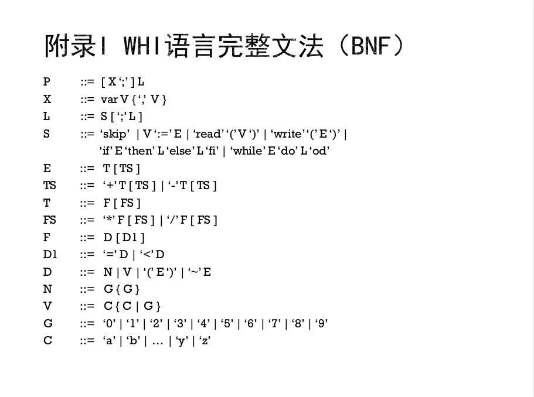
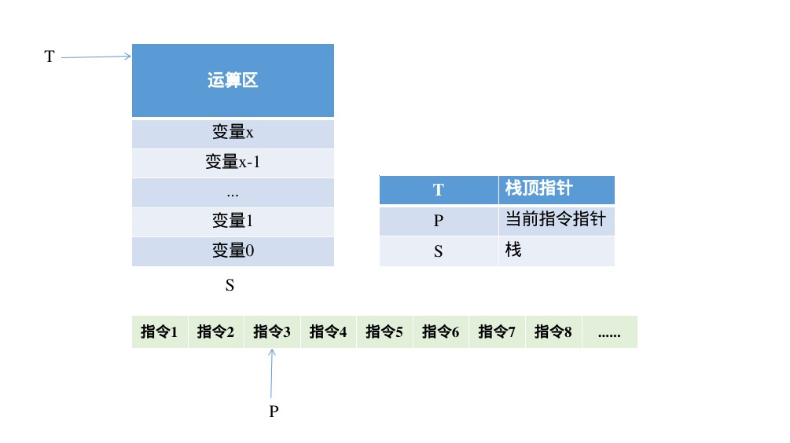
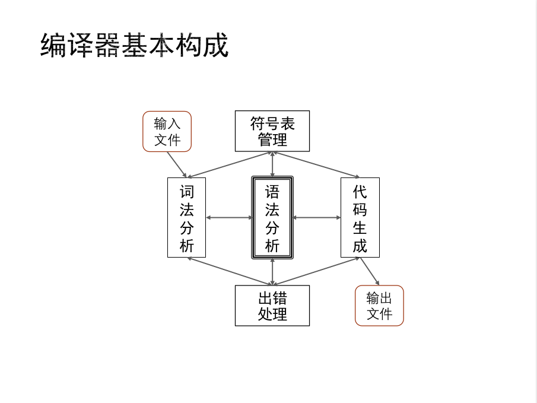

## 项目介绍
```
          _     _                             _ _           
__      _| |__ (_)   ___ ___  _ __ ___  _ __ (_) | ___ _ __ 
\ \ /\ / / '_ \| |  / __/ _ \| '_ ` _ \| '_ \| | |/ _ \ '__|
 \ V  V /| | | | | | (_| (_) | | | | | | |_) | | |  __/ |   
  \_/\_/ |_| |_|_|  \___\___/|_| |_| |_| .__/|_|_|\___|_|   
                                       |_|     

```
本项目打算用`C`语言设计一个极简的`WHI`语言编译器。`github`上也有不少极其优秀的且完整的项目，那么我的目的就是只关注编译器最核心的原理部分，而不是力求一定要尽善尽美。

设计原则将采用`kiss`原则，即使其尽可能的简单。

在`token`识别上，打算采用正则表达式匹配的做法来达到更好的识别`token`的目的。

在目标语言上，将源程序翻译为简单栈式抽象机代码。同时与预设结果进行比较以验证编译器的正确性。

项目任务及完成情况见`task.todo`文件

### WHI语言介绍
在 BNF 中，方括号中内容允许出现 0 次或 1 次，花括号中内容允许出现 0 次或多次。

以下给出 WHI 语言的巴克斯范式（BNF）为：



其中各符号含义如下
| 非终结符 | 含义           |
| -------- | -------------- |
| N        | 无符号整型常量 |
| V        | 有符号整型变量 |
| E        | 表达式         |
| S        | 语句           |
| L        | 语句列表       |
| X        | 变量声明       |
| P        | 程序           |

另请注意：在`WHI`语言中，表达式`~ E` 基于整型值实现逻辑非运算。若表达式 `E` 具有非零值，则表达式`~ E` 值为零，而若表达式 `E` 值为零，则表达式`~ E` 值为 `1`。在 `WHI` 语言程序中，将用户所声明变量自动初始化为 `0`。

实例程序
```c
var x1, x2, x3;
read(x3);
while x1 < x3 do
  x1 := x1 + 1;
  x2 := x2 + x1
od;
write(x2)
```

### 简单栈式抽象机（SSAM——Simple Stack-based Abstract Machine）介绍

简单栈式抽象机（`SSAM——Simple Stack-based Abstract Machine`）是一个高度简化的模型计算机。该计算机通过一个栈（`Stack`）保存变量的值和指令的操作数。从栈底单元开始的一系列连续的栈单元用来保存一系列变量的值。变量存储区域上方为运算区，指令可从该区域取得操作数，或将运算结果压入该区域。

栈可视为下标从 `0` 开始的一维数组。以下用 `S` 表示栈，栈底元素下标为 `0`，下标为 `k` 的栈元素为 `S[k]`。用 `T` 表示栈顶指针——即栈顶元素的下标。最后，用`P` 表示当前指令指针，一个 `SSAM` 程序可视为一个指令列表，存放在一维数组中，第一条指令下标为 `0`，当前指令下标为 `P`。

抽象机开始执行时 `P` 值为 `0`。通常，执行完一条指令后 `P` 值增 `1`，但若执行的指令为跳转指令（即 `jmp a` 或 `jpc a`），则根据跳转指令的功能更新 `P` 的值。当`P` 的值大于等于指令列表长度时（即 `P` 超出指令列表范围时），抽象机停机。

具体表示可为：



简单抽象机各个指令功能如下表所示
| 指令名称 | 含义                            | 操作                             |
| -------- | ------------------------------- | -------------------------------- |
| `add`    | 加法运算                        | `T--; S[T] <-- S[T] + S[T+1]`    |
| `sub `   | 减法运算                        | `T--; S[T] <-- S[T] - S[T+1] `   |
| `mul`    | 乘法运算                        | `T--; S[T] <-- S[T] * S[T+1] `   |
| ` div`   | 除法运算                        | `T--; S[T] <-- S[T] / S[T+1] `   |
| `equ `   | 相等比较                        | `T--; S[T] <-- (S[T] = S[T+1]`)  |
| `lth`    | 小于比较                        | `T--; S[T] <-- (S[T] < S[T+1]`)  |
| `lit a ` | 压入常数                        | `T++; S[T] <-- a `               |
| `lod a ` | 取变量值                        | `T++; S[T] <-- S[a]`             |
| `sto a`  | 存变量值                        | `S[a] <-- S[T]; T-- `            |
| `int a ` | 上移栈顶位置                    | `T <-- T + a `                   |
| `jmp a`  | 跳转                            | ` P <-- a`                       |
| `jpc a ` | 条件跳转                        | `T--; P <-- (S[T+1]==0 ? a : P)` |
| `red a ` | 输入数据，存入地址为 `a` 的变量 | `S[a] <-- input   `              |
| `wrt  `  | 输出栈顶数据                    | `T--; output S[T+1]`             |
| `swp`    | 交换栈元素                      | `S[T] <-> S[T-1]  `              |
| `nop `   | 空操作                          | 无                               |

具体解释为
+ `add` 先将栈指针下移一位，然后用当前栈指针指向的值`+`原来栈指针的值，其他运算指令类似。
+ `lod a` 从栈中取出地址为 `a` 的变量的值，即 `S[a]`（某种意义上这个取值操作打破了栈的抽象），并将该值放到栈顶。
+ `sto a` 将当前栈顶元素的值存入地址为 `a` 的变量，并将该栈顶元素弹出。
+ `int a` 将栈顶指针增加 `a`，该指令可在程序执行的初始阶段用来为程序的 `a` 个变量分配内存。
+ `jmp a` 将指令指针的值修改为 `a`，实现程序执行中的无条件跳转。
+ `jpc a` 弹出栈顶元素，并在该元素值为 `0` 的情况下将指令指针置为 `a`，实现程序执行中的有条件跳转。
+ `red a` 从用户输入一个整数，存入地址为 `a`的变量。
+ `wrt` 弹出栈顶数据元素，并将该数据元素值输出给用户。
+ `swp`，将栈顶附近的两个值交换
  
### 项目模块总设计



而每一个模块对应`/src`文件中的一个或二个`.c`文件,例如出错处理程序主要在`error.c`中进行编写，而 `parse.c`主要对应于语法分析的部分，至于代码生成则在`generate.c`文件里实现，剩下的辅助函数则交给`helper.c`文件。总体的调用思路如上图所示。而项目的细节实现部分请参加源码以及`src/design`文件夹下的模块设计文件。

### 运行

```
cd ~/Work
git clone git@github.com:Echo-b/minimalist-compiler.git
cd src
./run.sh ./test_file/input0.txt  
```
其中测试文件可以自行指定，具体可查看`test_file`文件夹下文件

### LICENSE
本项目使用 MIT License 协议