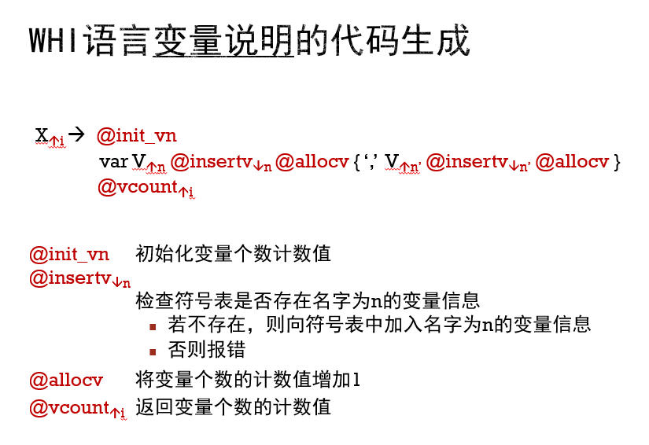

## 代码生成
### 构造每一条指令的生成动作
以`lod`为例

```c
void generate_instr_lod(Token_t t) {
  char instr[8] = {'\0'};
  int ret = serchslot(t.str);
  if (ret == -1) {
    printf("%s undefined\n", t.str);
    exit(-1);
  }
  sprintf(instr, "lod %d\n", ret);
  fprintf(ssam_out, "%s", instr);
}
```
需要解释的只有一点，就是首先我们必须检查该变量在全局符号表中的位置并返回，那么如果该变量不存在，我们就直接退出并报错。

## 插入语义动作
在这里我们需要做的就是需要将相应的代码生成函数插入到语法分析的代码中，然后将其输入到制定的代码输出文件。

一个实例如图：


```c
/**
 * @brief 
 * X ::= var V {',' V}
 * parse variable definite
 * nothing on successful
 * call handle_error() function on unsuccessful 
 */
void parse_vardeclation(){
  // generate_instr_int(Gsyspos);
  Token_t hold_token = get_token(); // skip var keyword
  match(hold_token,TK_IDENTIFIER);
  // generate_instr_var(hold_token);
  hold_token = get_token();
  if(hold_token.type == TK_COMMA){
    while(hold_token.type != TK_SEMI){
      match(hold_token, TK_COMMA);
      hold_token = get_token();
      match(hold_token, TK_IDENTIFIER);
      // generate_instr_var(hold_token);
      hold_token = get_token();
    }
    putback(hold_token);
    printf("token type %d\n",hold_token.type);
  }else {
    return;
  }
}
```
