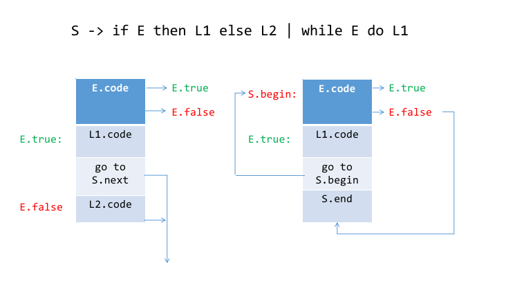
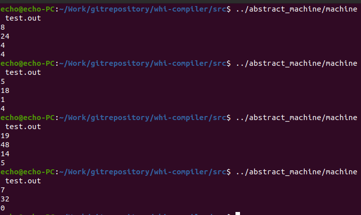

## 代码生成

### 回填链表的设计
由于我们需要在一遍扫描中生成指令代码，但是遇到分支循环语句时，由于执行时间的限制，我们暂时看不到后续跳转的位置，因此我们就需要一种数据结构将需要跳转的位置保存下来，当我们执行到合适的位置的时候对其进行回填。而具体的数据结构设计如下：

```c
struct backpatchlist
{
  int inst_remain;
  struct backpatchlist *tail;
  struct backpatchlist *next;
};

```
首先是一个用于存储待回填的指令标号字段，紧接着是链表的尾指针，最后是存储下一个链表结构的字段。尾指针的设计我认为是比较合理的，其避免了两个均持有一定元素的链表在合并时的遍历问题，即寻找合适的插入位置。而如果存储了尾指针，首先初始必为只持有一个元素的两个链表合并，我们对其执行以下操作，这样后续的合并操作我们就可以用O(1)的时间复杂度来完成。
```
struct backpatchlist *merge(struct backpatchlist *bpl1, struct backpatchlist *bpl2){
  if(!bpl1 && !bpl2){
    return nullptr;
  } else if(!bpl1 && bpl2){
    return bpl2;
  } else if(bpl1 && !bpl2){
    return bpl1;
  } else{
    bpl1->tail->next = bpl2;
    bpl1->tail = bpl2->tail;
    return bpl1;
  }
}
```

### 控制语句跳转时机



对于控制语句我们需要在合适的位置插入必要的语义动作，具体来说如下


我们对其进行相应的解释，首先我们需要对表达式生成代码，从代码执行的角度来看，最后表达式的运算结果会被放到栈顶，假设为`a`，那么我们就需要比较该值是否为`0`来判断是不是需要跳转到`else`分支后的语句执行，那么就需要在这里插入一个`brf`的语义动作，他会用下一条语句的标号生成一个回填链表`la`以及一条有条件跳转指令`jpc`，之所以用下一条语句的标号刚好对应我们之后生成的`jpc`指令。

如果条件成立，那么我们就顺序执行`L1`语句部分的内容，当执行完`L1`我们就需要从`if`语句跳出，因此这里首先需要插入一条`jmp`指令，而因为我们还没有执行完`if`语句，所以此时我们还不知道对应的跳转标号，因此也需要一个回填链表`lb`。在者因为`L1`也可以是一个`if`或`while`语句，因此当内部的循环执行完毕的时候也会需要跳出整个循环，故我们需要保存`L1`内部的回填链表，用于执行后续操作。

当执行到`else`的时候，此时我们就知道表达式不成立的时候需要跳转的位置，因此对`la`回填，回填标号是下一条语句。继续执行会执行到`L2`，显然`L2`也可以是一个`if`或`while`语句，因此当内部的循环执行完毕的时候也会需要跳出整个循环，故我们需要保存`L2`内部的回填链表，最后识别到`fi`的时候我们将内部需要跳出循环的所有回填链表进行合并，传递给调用者用于执行后续操作。


对于`while`语句的话，我们唯一可以跳出循环的条件就是表达式不成立的情况，如果表达式成立我们需要重复执行内部语句内容。因此我们需要保存进入`while`时的指令标号用于后续跳转。之后`brf`语义动作和`if`语句相同，不做赘述。继续往下执行就到了`L`部分，同样的道理`L`也可以是一个`if`或`while`语句，因此当内部的循环执行完毕的时候也会需要跳出整个循环，故我们需要保存`L`内部的回填链表，且此时`while`语句执行完毕，我们也知道了跳出的位置标号，故回填，而在此之前需要先生成一条无条件跳转指令`jmp`，跳转目标为我们在进入`while`时保存的标号。

### 构造每一条指令的生成动作
以`lod`为例

```c
void generate_instr_sto(Token_t t) {
  int ret = serchslot(t.str);
  inst_array[instr_cnt].op = _sto;
  inst_array[instr_cnt].a = ret;
  instr_cnt++;
}
```
在这里我们只需要将指令数组的对应位置进行赋值即可。并且对于一个变量我们需要检索全局符号表以找到其对应的位置。

## 插入语义动作
在这里我们需要做的就是需要将相应的代码生成函数插入到语法分析的代码中，然后将其输入到制定的代码输出文件。我们对`while`和`if`做过具体的介绍，因此我们以`while`为例，看看其具体的插入时机及位置。

```c
/**
 * @brief 
 * parse while statement
 * while E do L od
 * nothing on successful
 * call handle_error() function on failure 
 * @return struct backpatchlist* 
 */
struct backpatchlist *parse_while_stmt(){
  Token_t hold_token = tokens[p_token];
  match(hold_token,TK_WHILE);
  hold_token = get_token(); // skip while keyword

  int instr_start = nextinst();   // @ini

  parse_expression();

  struct backpatchlist *la = brf(); // @brf

  hold_token = tokens[p_token];

  if (TK_DO == hold_token.type) {
    Print("token 'do' parsing via");
    hold_token = get_token(); // skip do keyword
    struct backpatchlist *lst = parse_stmt_list();

    generate_instr_jmp(instr_start);   // @br

    backpatch(lst, instr_start);  // @patch

    hold_token = tokens[p_token];

    if (TK_OD == hold_token.type) {
      Print("token 'od' parsing via");
      hold_token = get_token(); // skip od keyword
    } else {
      handle_error(ERROR_x05,hold_token.row,hold_token.col); // lack od
    }
  } else {
    handle_error(ERROR_x06,hold_token.row,hold_token.col); // lack do
  }
  return la;
}
```
这一部分也是很简单的，很明显根据我们之前的分析在对应位置插入相应的语义动作即可。

### 测试生成

#### 测试文件代码
以求解鸡兔同笼问题的代码为例:

```c
//source code
var head, foot, cock, rabbit, n;
n := 0;
read(head);
read(foot);
cock := 1;
while (cock < head) + (cock = head) do
  rabbit := head - cock;
  if (cock * 2 + rabbit * 4) = foot then
    write(cock);
    write(rabbit);
    n := n+1
  else
    skip
  fi;
  cock := cock + 1
od;
if n = 0 then write(0) else skip fi


```

生成`ssam`代码如下
```
int  5
lit  0
sto  0
lit  0
sto  1
lit  0
sto  2
lit  0
sto  3
lit  0
sto  4
lit  0
sto  4
red  0
red  1
lit  1
sto  2
lod  2
lod  0
lth
lod  2
lod  0
equ
add
jpc  53
lod  0
lod  2
sub
sto  3
lod  2
lit  2
mul
lod  3
lit  4
mul
add
lod  1
equ
jpc  48
lod  2
wrt
lod  3
wrt
lod  4
lit  1
add
sto  4
jmp  48
lod  2
lit  1
add
sto  2
jmp  17
lod  4
lit  0
equ
jpc  60
lit  0
wrt
jmp  60
nop
```

#### 验证
我们用四组测试数据验证
```
data 1:
head = 8
foot = 24

=> answer 
cock = 4
rabbit = 4

data 2:
head = 5
foot = 18

=> answer 
cock = 1
rabbit = 4

data 3:
head = 19
foot = 48

=> answer 
cock = 14
rabbit = 5

data 4:
head = 7
foot = 32

=> answer 
0 (无解)

```
实际运行效果与预期一致

