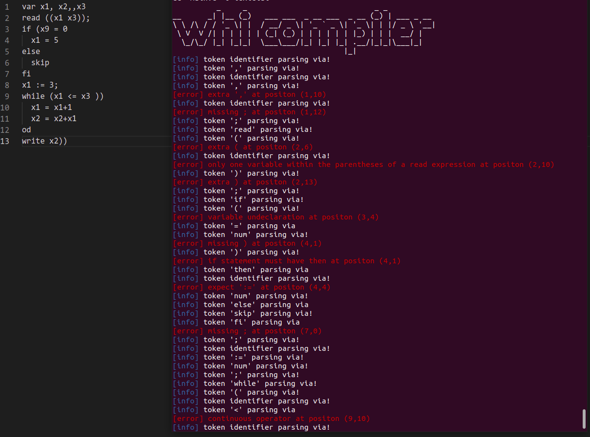

### 正则表达式介绍
[正则表达式](https://zh.wikipedia.org/wiki/%E6%AD%A3%E5%88%99%E8%A1%A8%E8%BE%BE%E5%BC%8F)（英语：`Regular Expression`，常简写为`regex`、`regexp`或`RE`），又称正则表示式、正则表示法、规则表达式、常规表示法，是计算机科学的一个概念。正则表达式使用单个字符串来描述、匹配一系列匹配某个句法规则的字符串。在很多文本编辑器里，正则表达式通常被用来检索、替换那些匹配某个模式的文本。

### 正则表达式常见规则
构造正则表达式的方法：用多种元字符与运算符将小的表达式结合在一起来创建更大的表达式。正则表达式的组件可以是单个的字符、字符集合、字符范围、字符间的选择或者所有这些组件的任意组合。

正则表达式是由普通字符（例如字符 `a` 到 `z`）以及特殊字符（称为"元字符"）组成的文字模式。模式描述在搜索文本时要匹配的一个或多个字符串。正则表达式作为一个模板，将某个字符模式与所搜索的字符串进行匹配。

#### 普通字符
| 字符     | 描述                                                                 | 实例                                              |
| -------- | -------------------------------------------------------------------- | ------------------------------------------------- |
| `[ABC]`  | 匹配`ABC`串内的所有字符                                              | 用[ogl]匹配`google`可以匹配`googl`                |
| `[^ABC]` | 匹配除了`ABC`串内的所有字符                                          | 用`[^ogl]`匹配`google`可以匹配`e`                 |
| `[A-Z]`  | `[A-Z]` 表示一个区间，匹配该区间内的所有符号                         | `[0-9]`匹配`0`到`9`的数字                         |
| .        | 匹配除换行符（`\n、\r`）之外的任何单个字符，相等于 [^\n\r]           | 用`[ogl]`匹配`google`可以匹配`google`不包括换行符 |
| `[\s\S]` | 匹配所有。`\s` 是匹配所有空白符，包括换行，`\S` 非空白符，不包括换行 | 用其匹配`google`可以匹配`google`包括换行符        |
| `[\w]`   | 匹配数字，字母，下划线。等价于[A-Za-z0-9]                            | 例如可以匹配类似`Ax0`                             |

#### 非打印字符

| 字符  | 描述                                                |
| ----- | --------------------------------------------------- |
| `\cx` | 匹配由`x`指明的字符，如`\cM`匹配`Control-M`或回车符 |
| `\f`  | 匹配一个换页符                                      |
| `\n`  | 匹配一个换行符                                      |
| `\r`  | 匹配一个回车符                                      |
| `\s`  | 匹配任何空白字符，包括空格，制表符，换页符等等      |
| `\S`  | 匹配任何非空白字符                                  |
| `\t`  | 匹配一个制表符                                      |
| `\v`  | 匹配一个垂直制表符                                  |


#### 特殊字符

| 字符 | 描述                                                                                   |
| ---- | -------------------------------------------------------------------------------------- |
| `$`  | 匹配输入字符串的结尾位置                                                               |
| `()` | 标记一个子表达式的开始和结束位置                                                       |
| `*`  | 匹配前面的子表达式零次或多次                                                           |
| `+`  | 匹配前面的子表达式一次或多次                                                           |
| `.`  | 匹配除换行符 \n 之外的任何单字符                                                       |
| `[`  | 标记一个中括号表达式的开始                                                             |
| `?`  | 匹配前面的子表达式零次或一次                                                           |
| `\`  | 将下一个字符标记为或特殊字符、或原义字符、或向后引用、或八进制转义符                   |
| `^`  | 匹配输入字符串的开始位置，当在方括号表达式中使用时，表示不接受方括号表达式中的字符集合 |
| `{`  | 标记限定符表达式的始                                                                   |
| `    | `                                                                                      | 指明两项之间的一个选择 |

#### 限定符

| 字符    | 描述                                                                    |
| ------- | ----------------------------------------------------------------------- |
| `*`     | 匹配前面的子表达式零次或多次                                            |
| `+`     | 匹配前面的子表达式一次或多次                                            |
| `?`     | 匹配前面的子表达式零次或一次                                            |
| `{n}`   | `n `是一个非负整数。匹配确定的 `n` 次                                   |
| `{n,}`  | `n` 是一个非负整数。至少匹配`n` 次                                      |
| `{n,m}` | `m` 和 `n` 均为非负整数，其中`n <= m`。最少匹配 `n` 次且最多匹配 `m` 次 |

### 从状态机的视角来审视正则表达式
以邮箱表达式的匹配规则对应生成的状态图为例


从状态图来看，首先我们会进入第一个匹配模块，该模块可以匹配数字，字母和下划线一次或者多次，其实这里写代码的话就会对应着一个`while`循环。紧接着是`@`的匹配，然后类似第一个的循环。最后是两个循环的匹配，每个循环都匹配一个`.xxx`的串。这也是符合邮箱的格式的。通过这个图形我们可以很直观的看到一个具体的识别过程，另外其实也可以说明我们的每一个正则表达式都可以转化为一个状态图。那么我们的`token`识别本质上就是一个`token`对应一个状态机，而一个状态机对应一个正则表达式。所以用正则表达式来匹配`token`是可行的，而且其的优势在于它在直观上看减少了代码量，因为其不用显示的书写各种循环代码。虽然其本质工作可能依然没有改变，但是对上层人员编写可读性更高的代码提供了可能。

### C语言对应的正则表达式函数结构概览
`C`语言也对正则表达式的识别进行了封装，使用时，我们需要引入头文件`<regex.h>`，一般用以下三个步骤进行使用:
  1. 使用`regcomp()`将字符串编译为正则表达式 
  2. 用上一步得到的正则表达式，调用`regexec()`来对输入进行匹配
  3. 使用完毕调用`regfree()`释放正则表达式
  4. 如果出错，调用`regerror()`输出

下面是具体的介绍:

#### `regcomp()`函数
```c
int regcomp(regex_t *preg, const char *regex, int cflags);
```
- `regex_t` 是一个结构体数据类型，用来存放编译后的正则表达式。
- `regex` 我们编写的表达式指针。
- `cflags` 有如下`4`个值或者是它们或运算`(|)`后的值：
`REG_EXTENDED` 以功能更加强大的扩展正则表达式的方式进行匹配。
`REG_ICASE` 匹配字母时忽略大小写。
`REG_NOSUB` 不存储匹配后的结果。
`REG_NEWLINE` 识别换行符，以便`$`从行尾开始匹配，`^`从行的开头开始匹配。


#### `regmatch_t `结构
```c
typedef struct {
  regoff_t rm_so;
  regoff_t rm_eo;
} regmatch_t;
```

 `rm_so` 存放匹配文本串在目标串中的开始位置，`rm_eo` 存放结束位置。有了这一结构，我们就可以将识别到的关键字，标识符和整数存储到指定位置。

#### `regerror()`函数
```c
size_t regerror(int errcode, const regex_t *preg, char *errbuf,
            size_t errbuf_size);
```
当执行 `regcomp` 或者`regexec` 产生错误，就可以调用这个函数而返回一个包含错误信息的字符串。`errbuf`在这里作为传出参数，我们需要声明一块用于存储错误信息的地址，然后传入，如果出错，可从该地址查看具体的错误信息。

#### `regexec()`函数
```c
int regexec(const regex_t *preg, const char *string, size_t nmatch,
            regmatch_t pmatch[], int eflags);
```

当我们编译好正则表达式后,就可以调用`regexec` 来匹配我们的目标文本串，如果在编译正则表达式的时候没有指定`cflags`的参数为`REG_NEWLINE`，则默认情况下是忽略换行符的，也就是把整个文本串当作一个字符串处理。执行成功返回`０`

- `preg`: 用`regcomp`函数编译好的正则表达式。
- `string`:目标文本串。
- `nmatch`: `regmatch_t`结构体数组的长度。
- `pmatch[]`: `regmatch_t`类型的结构体数组，存放匹配文本串的位置信息。
- `eflags`有二个取值
    `REG_NOTBOL`:指定之后，就不会匹配开始的`^`字符，
    `REG_NOTEOL`:指定之后，就不会匹配结束的`$`字符，              

#### `regfree()`函数
```c
void regfree(regex_t *preg);
```
清空`preg`指向的`regex_t`结构体的内容。

### 词法分析
#### 词法分析程序设计
在词法分析这一部分，我们主要采用正则表达式来识别我们`WHI`语言中的具体词素，而关于正则表达式的具体设计，我们在上面对其进行了简要的介绍，并引入了`Ｃ`语言中与之对应的库函数。我的大致思路是，对每一个要识别的`token`都编写一个与之对应的正则表达式，然后用相应的库函数将其构造为`C`语言中标准的正则表达式结构。之后读入我们的程序源文件，识别出每一个`token`，对于标识符，关键字，整数则将其存储到制定的位置。

具体的规则编写在上述文章已经介绍过，再次不做赘述，每个正则表达式的对应规则如下
```c
struct rule {
  const char* regex;
  int token_type;
  int precedence;
} rules[] = {

    {"\\s", TK_NOTYPE, 10},                  // spaces
    {"[a-z]+[0-9a-z]*", TK_IDENTIFIER, 10},  // variable definte
    {"=", TK_EQ, 2},                         // equal
    {":=", TK_ASSIGN, 2},    // := assign 
    {",", TK_COMMA, 10},     // ,
    {"\\(", TK_LP, 10},      // left parenthesis
    {"\\)", TK_RP, 10},      // right parenthesis
    {"\\+", TK_PLUS, 4},     // plus
    {"-", TK_MINUS, 4},      // minus
    {"\\*", TK_MUL, 5},      // multiple
    {"/", TK_DIV, 5},        // div
    {"[0-9]+", TK_NUM, 10},  // number
    {"~", TK_NOT, 6},        // ~
    {"<", TK_LESS, 3},       // <
    {";", TK_SEMI, 10},      // ;

};
```
这里我们以变量名的识别为例，进行介绍。首先对于正则表达式的规则`[a-z]+[0-9a-z]*`，由于我们的变量只由小写字母和数字组成，且必须以小写字母开头，因此我们首先用`[a-z]+`识别一个或多个小写字母，然后用`[0-9a-z]*`识别数字和字母的组合，其中后面的部分可以重复0次或多次，也即我们的正则表达式需要匹配纯字母或单字母的情况。

#### 正则表达式初始化构造
其实有了上面的铺垫后，这一部分就显得比较简单了，具体就是调用`regcomp`将我们上面指定的字符串规则构造为可以识别的正则表达式。具体如下:
```c
void init_regex() {
  int i;
  char error_msg[128];
  int ret;

  for (int i = 0; i < NR_REGEX; ++i) {
    ret = regcomp(&re[i], rules[i].regex, REG_EXTENDED);
    if (ret != 0) {
      regerror(ret, &re[i], error_msg, 128);
      printf("regex compilation failed: %s\n%s", error_msg, rules[i].regex);
    }
  }
}
```

#### 匹配识别
至于匹配识别这一部分就需要考虑的稍微多一些，具体我们要考虑的点有如下几个
1. 区分需要存储的和不需要存储的
2. 对于关键字和标识符以及整数需要将识别到的子串进行提取存储
3. 区分开关键字和标识符
4. 将标识符加到全局变量表中
5. 加入全局变量表的标识符不能重复且必须是`var`和`;`之间识别到的标识符。

以这个思路，我们分别对应的解决措施
1. 用`case`语句分开不同的情况
2. 利用`regmatch_t`结构体的信息进行子串的提取
3. 构造关键字表，书写`is_keyword()`函数，如果是关键字返回其类型，不是返回 `-1`
4. 构造全局符号表，利用`addglob()`函数将标识符加入其中，利用`searchslot()`可以返回其具体位置，也即建立标识符和全局符号表之间的映射关系。
5. 加入静态全局变量`add_gsyt_flag`，初始值为`0`，识别到`var`将其设置为`1`，识别到`;`将其设置为`0`。另在调用`addglob()`函数时，判断`add_gsyt_flag`，为`1`则调用加入，为`0`不执行。

具体的部分代码如下
```c
switch (rules[i].token_type) {
case TK_NOTYPE:
  break;
case TK_COMMA:
  tokens[nr_token].type = rules[i].token_type;
  if (tokens[nr_token].type == TK_SEMI)
    add_gsyt_flag = 0;
  nr_token++;
  break;
case TK_IDENTIFIER:
  bzero(tokens[nr_token].str, 0);
  strncpy(tokens[nr_token].str, substr_start, substr_len);

  // judge => the identifier is a keyword?
  int ret;
  if ((ret = id_iskeyword(tokens[nr_token].str)) != -1) {
    if (ret == TK_VAR)
      add_gsyt_flag = 1;
    tokens[nr_token].type = ret;
  } else {
    tokens[nr_token].type = rules[i].token_type;
    if (add_gsyt_flag == 1) {
      if (addglob(tokens[nr_token].str) == -1)
        return (-1);
    }
  }
default:;
```

#### 测试
测试文件
```clike
var x0, y0, x, y, g, m, temp;
x0 := x;
y0 := y;
read(x);
write(x);
```

识别结果
```
token type=> [271] 	 token value => [var] 	 position =>(1,0)
token type=> [258] 	 token value => [x0] 	 position =>(1,4)
token type=> [270] 	 token value => [] 	 position =>(1,6)
token type=> [258] 	 token value => [y0] 	 position =>(1,8)
token type=> [270] 	 token value => [] 	 position =>(1,10)
token type=> [258] 	 token value => [x] 	 position =>(1,12)
token type=> [270] 	 token value => [] 	 position =>(1,13)
token type=> [258] 	 token value => [y] 	 position =>(1,15)
token type=> [270] 	 token value => [] 	 position =>(1,16)
token type=> [258] 	 token value => [g] 	 position =>(1,18)
token type=> [270] 	 token value => [] 	 position =>(1,19)
token type=> [258] 	 token value => [m] 	 position =>(1,21)
token type=> [270] 	 token value => [] 	 position =>(1,22)
token type=> [258] 	 token value => [temp] 	 position =>(1,24)
token type=> [268] 	 token value => [] 	 position =>(1,28)
token type=> [258] 	 token value => [x0] 	 position =>(2,0)
token type=> [269] 	 token value => [] 	 position =>(2,3)
token type=> [258] 	 token value => [x] 	 position =>(2,6)
token type=> [268] 	 token value => [] 	 position =>(2,7)
token type=> [258] 	 token value => [y0] 	 position =>(3,0)
token type=> [269] 	 token value => [] 	 position =>(3,3)
token type=> [258] 	 token value => [y] 	 position =>(3,6)
token type=> [268] 	 token value => [] 	 position =>(3,7)
token type=> [273] 	 token value => [read] 	 position =>(4,0)
token type=> [266] 	 token value => [] 	 position =>(4,4)
token type=> [258] 	 token value => [x] 	 position =>(4,5)
token type=> [267] 	 token value => [] 	 position =>(4,6)
token type=> [268] 	 token value => [] 	 position =>(4,7)
token type=> [274] 	 token value => [write] 	 position =>(5,0)
token type=> [266] 	 token value => [] 	 position =>(5,5)
token type=> [258] 	 token value => [x] 	 position =>(5,6)
token type=> [267] 	 token value => [] 	 position =>(5,7)
token type=> [268] 	 token value => [] 	 position =>(5,8)
token type=> [282] 	 token value => [] 	 position =>(0,0)

全局符合表内容
the var name is [x0],the position is [0]
the var name is [y0],the position is [1]
the var name is [x],the position is [2]
the var name is [y],the position is [3]
the var name is [g],the position is [4]
the var name is [m],the position is [5]
the var name is [temp],the position is [6]
```

## 语法分析设计

### 设计概要
#### 关于错误处理部分的设计
对于错误处理，我们主要将所有的错误类型定义在一个结构体中
```c
struct grammer_error{
  int errorkind;
  const char* str;
  // void (*handler) (int errorkind,int row, int col);
} errors[];
```
之所以将其分离开来，而不是直接在有错误的地方用`printf`打印的主要原因在于，尽量减少模块之间的耦合性。而且这样设计的好处还在于，我们可以在结构体中加入更多的特性，比如后期可能为每一个错误处理增加一个出错处理函数（如注释部分所示），当我们识别到具体的错误时就对其进行一定的处理达到识别多个错误的目的，而不是简单的识别一个错误然后直接退出，这样可以减少用户因多个错误导致的多次编译。

#### 关于非终结符解析函数部分的设计
而在函数解析部分，其实最重要的一个点就是递归调用的思想以及在合适的时机获取`token`，因此就需要明确`token`的获取时机，故我们对获取时机做出以下规定：
  1. 对于每一个子过程的调用都直接带着一个已经读入的`token`进行分析
  2. 当子过程调用结束时，要获取下一个`token`，用于下一个过程的分析识别

#### 辅助函数`match()`的设计
为了匹配识别我们的具体的`token`，在`helper.c`文件中加入了`match(Token_t hold, int expected)`函数，它主要的工作在于将`hold`和`expected`进行比较，然后返回判断结果，我并没有直接在文件中用`if`语句进行判断，主要理由在于分开有利于出错函数的插入和后续功能的增加，例如若我们想要在匹配到某一个`token`的时候，加入一些额外的输出信息，或者进行一些处理，那么就可以直接加入对应的模块，从而进一步与解析函数进行解耦合。另判断两个`token`是否相等这一功能使用比较频繁，因此封装为函数也更为合理。

#### 识别多个错误
在考虑一遍扫描中识别多个错误的情况时，我们需要明确以下几点：
  1. 不存在缺少的`token`，只是对应位置类型不匹配，如
      - `=`做赋值运算符
      - 使用未定义的变量 
  2. 存在缺少的`token`，如
      - 分号，逗号的缺失
      - 括号不匹配
  3. 存在多余的`token`
      - 分号，逗号的多余
      - 括号不匹配

对应的解决方案是
  1. 对于第一种情况，我们不用额外考虑措施，因为其不会打乱程序的正常执行，只是会引发类型不匹配的错误
  2. 对于第二种情况，我们需要插入缺失的`token`，从而使执行流恢复正常
  3. 对于第三种情况，我们需要删除多余的`token`，其实也即跳过多余的`token`

然而，存在的问题是我们如何确定，此次的出错是由于上述的那一种情况造成的，为此我们需要定义以下的几个规则以判别此次的出错种类。故作出下列的规定：

|语句类型|多余定义|缺失定义|匹配错误|
|-|-|-|-|
|类型声明|连续识别到两个`,`号|连续识别到两个`identifier`|`,`号写成其它可通过词法检查的符号|
|赋值语句|`:=`前或后连续识别到两个`identifier`|无`:=`或者`:=`后无`identifier`|`:=`号写成其它可通过词法检查的符号|
|表达式语句|连续识别到两个运算符或者多余括号|连续识别到两个`identifier`或者括号不匹配|运算符写成其他可通过词法检查的符号|
|`if`语句|同表达式|缺失关键字或`;`号|合并赋值和表达式的情况|
|`while`语句|同表达式|缺失关键字或`;`号|合并赋值和表达式的情况|
|`read`语句|多个括号或者括号内多个变量|括号内无变量，无左括号或右括号|`identifier`未定义|
|`write`语句|同表达式|同表达式或者括号不匹配|同表达式|

#### 示例
可一次性识别错误类型示例如下
|错误类型|示例|
|-|-|
|声明语句连续的`,`号|`a,,b`|
|缺少`;`号|`var x,y,z`|
|`while`语句缺少关键字|`while a < b x := y od`|
|`if`语句缺少关键字|`if a < b then x :=y skip`|
|`read`语句括号不匹配|`read((x)), read(x, read x)`|
|`read`语句含多个变量|`read(x y)`|
|`write`语句括号不匹配|`write(x, write a+b) `|
|表达式连续两个运算符|`a <= b, a == b, a ** b`|
|表达式缺少运算符|`a b, 10 7`|
|表达式缺少右括号|`(a = b`|
|表达式存在多余的右括号|`(a = b))`|
|赋值符号错误写成其他符号|`a = b`|
|变量未声明，假设`b`未声明|`a := b`|

#### 代码示例
```c
/**
 * @brief 
 * parse write statement and generate write instr
 * write(E)
 * nothing on successful
 * call handle_error() function on failure 
 */
void parse_write_stmt(){
  Token_t hold_token = get_token(); // get write keyword
  match(hold_token,TK_WRITE);

   // missing (
  if(TK_LP != tokens[p_token].type){
    handle_missing(ERROR_x08,tokens[p_token].row,tokens[p_token].col);
  }

  hold_token = get_token();
  match(hold_token, TK_LP);

  parse_expression();
  // generate_instr_wrt();
  hold_token = tokens[p_token];

  // missing ) 
  if(TK_RP != tokens[p_token].type){
    handle_missing(ERROR_x09,tokens[p_token].row,tokens[p_token].col);
    hold_token = get_token();
    putback(tokens[p_token]);
  }

  match(hold_token, TK_RP);
  hold_token = get_token(); 

  // extra )
  if(TK_RP == tokens[p_token].type){
    if(right_parentheses_cnt + 1 != left_parentheses_cnt)
      handle_extra(ERROR_x28,tokens[p_token].row,tokens[p_token].col);
  }

}
```
我们以`write(E)`的多错误处理为例来介绍我们的基本思想的实现。首先对于没有左括号的情况，我们需要在进入`parse_write_statement()` 函数就提前判断下一个`token`，如果不是`(`，那么证明我们缺失左括号，这时我们调用`handle_missing()`函数来在输入流中插入一个`(`括号，并调用`get_token()`获取这个`(`括号，另外我们还需要将超前读入的`identifier`或者其他标识符放回到`tokens`数组中，即调用`putback()`函数，而对于存在额外的`)`括号这一点，我们就需要考虑左右括号的数量关系，为此我们设立了两个变量`right_parentheses_cnt, left_parentheses_cnt`，他们只会在`match`函数中匹配到左右括号时自增，那么如果我们查看下一个`token`，发现它为右括号并且其加一的数量不等于左括号的数量，证明我们的右括号存在多余，此时我们就需要跳过多余的右括号，就调用`handle_extra()`函数，其在内部多调用一次`get_token()`。反之如果左右括号数量相等，我们不做处理。

### 识别条件的判断
当读入一个`token`,需要判断要调用那一个子过程来进行识别，本质上就是对每一个非终结符求`FIRST`集，然后根据不同的符号，匹配进入不同的识别过程，下面是`WHI`语言的文法的非终结符的`FIRST`集

| 非终结符 | FIRST集          |
| -------- | -------------- |
| P        |`{var, skip, read, write, if, while, id(FIRST(C))}`|
| X        |`{var}`|
| L        |`{skip, read, write, if, while, id(FIRST(C))}`|
| S        |`{skip, read, write, if, while, id(FIRST(C))}`|
| E        |`{num(FIRST(G)), id(FIRST(C)), (, ~}`|
| TS       |`{+, -}`|
| T        |`{num(FIRST(G)), id(FIRST(C)), (, ~}`|
| FS       |`{*, /}`|
| F        |`{num(FIRST(G)), id(FIRST(C)), (, ~}`|
| D1       |`{=, <}`|
| D        |`{num(FIRST(G)), id(FIRST(C)), (, ~}`|
| N        |`{num(FIRST(G))}`|
| V        |`{id(FIRST(C))}`|
| G        |`{num(FIRST(G))}`|
| C        |`{id(FIRST(C))}`|

其中，`num(FIRST(G)), id(FIRST(C))`分别对应着`TK_NUM,TK_IDENTIFIER`，也即当终结符为`G,C`时，我们调用函数`match(Token_t hold, Token_t expected)`来检查当前`token`是否相匹配。

### 识别过程
首先根据文法的`BNF`范式


在具体解析的时候，我们需要根据文法的每一个非终结符。编写对应的解析函数。以变量声明为例

```c
/**
 * @brief 
 * X ::= var V {',' V}
 * parse variable definite
 * nothing on successful
 * call handle_error() function on unsuccessful 
 */
void parse_vardeclation(){
  Token_t hold_token = get_token(); // skip var keyword
  match(hold_token,TK_IDENTIFIER);
  hold_token = get_token();
  if(hold_token.type == TK_COMMA){
    while(hold_token.type != TK_SEMI){
      match(hold_token, TK_COMMA);
      hold_token = get_token();
      match(hold_token, TK_IDENTIFIER);
      hold_token = get_token();
    }
    putback(hold_token);
  }else {
    return;
  }
}
```
根据变量声明的文法`X ::= var V {',' V}`,在程序一开始我们会识别到一个`var`关键字，然后经过层级间的调用，进入到变量声明的解析。首先需要识别一个标识符，然后通过`get_token()`函数获取下一个`token`，判断是不是`,`，若是一个`,`号，那么证明我们需要继续对变量声明的解析，进入`while`循环，首先匹配识别一个`,`号，然后获取下一个`token`，匹配其是否为一个标识符，之后重复这个过程。当然这里其实多判断了一步，即识别到一个`,`号然后进入循环，又匹配其是否为`,`号，显得似乎有些重复，但是主要目的在于统一识别的形式，使整个过程与语法的描述更加的贴合，也更利于理解。而对于识别结束的判断，我们主要判断当前拥有的`hold_token`是否为`;`，若是那么证明我们对变量的解析结束，直接返回，匹配一下个过程，但需要注意的一点是因为我们当前的`token`是`;`，所以需要将提前读入的`;`号放入原`tokens`数组，即调用`putback()`函数。

### 语法解析的错误处理
当我们发现文法中出现语法错误，也即在合适的位置出现的不是我们所期待的`token`我们就需要报出错误，提示用户进行改正。而在错误处理这一部分，我主要定义了如下的错误类型，然后在每一个非终结符对应的解析函数的合适的位置插入错误处理函数`handle_error()`。我们需要将出错的行列信息和出错码传递给出错处理函数，其在内部调用`Log()`函数，进行一个简单的提示信息打印，为了更加的醒目，我为出错处理提示信息加上了颜色。

|错误类型种别|描述|
|-|-|
|`ERROR_x00`| `missing ;`|
|`ERROR_x01`|`declaration syntax error`|
|`ERROR_x02`|`division by zero`|
|`ERROR_x03`|`expression syntax error`|
|`ERROR_x04`|`variable undeclaration`|
|`ERROR_x05`|`while statement must have od`|
|`ERROR_x06`|`while statement must have do`|
|`ERROR_x07`|`if statement must have fi`|
|`ERROR_x08`|`expect (`|
|`ERROR_x09`|`missing )`|
|`ERROR_x10`|`declaration missing ','`|
|`ERROR_x11`|`unknown mistake`|
|`ERROR_x12`|`if statement must have else`|
|`ERROR_x13`|`if statement must have then`|
|`ERROR_x14`|`expect ':='`|
|`ERROR_x15`|`expect 'read' keyword`|
|`ERROR_x16`|`expect 'write' keyword`|
|`ERROR_x17`|`expect '~'`|
|`ERROR_x18`|`expect 'while' keyword`|
|`ERROR_x19`|`expect 'if' keyword`|
|`ERROR_x20`|`expect 'skip' keyword`|
|`ERROR_x21`|`expect a arithmetic operators such as '+','-','*','/'`|
|`ERROR_x22`|`expect a relational operator such as '=' and '<'`|
|`ERROR_x23`|`expect a decimial int number`|
|`ERROR_x24`|`program aborted unexpectedly, exited with -1`|
|`ERROR_x25`|`extra ';'`|
|`ERROR_x26`|`extra ','`|
|`ERROR_x27`|`extra (`|
|`ERROR_x28`|`extra )`|
|`ERROR_x29`|`there must be a variable inside the parentheses`|
|`ERROR_x30`|`only one variable within the parentheses of a read expression`|
|`ERROR_x31`|`operator is required between two identifiers`|
|`ERROR_x32`|`operator is required between two num`|
|`ERROR_x33`|`continuous operator`|

此处的错误类型定义可能并未完全使用到，诸如`ERROR_x02`，是语义层面的错误，语法层面无法暂时未对此情况作出处理。最终的效果如下图所示：



## 代码生成

### 回填链表的设计
由于我们需要在一遍扫描中生成指令代码，但是遇到分支循环语句时，由于执行时间的限制，我们暂时看不到后续跳转的位置，因此我们就需要一种数据结构将需要跳转的位置保存下来，当我们执行到合适的位置的时候对其进行回填。而具体的数据结构设计如下：

```c
struct backpatchlist
{
  int inst_remain;
  struct backpatchlist *tail;
  struct backpatchlist *next;
};

```
首先是一个用于存储待回填的指令标号字段，紧接着是链表的尾指针，最后是存储下一个链表结构的字段。尾指针的设计我认为是比较合理的，其避免了两个均持有一定元素的链表在合并时的遍历问题，即寻找合适的插入位置。而如果存储了尾指针，首先初始必为只持有一个元素的两个链表合并，我们对其执行以下操作，这样后续的合并操作我们就可以用O(1)的时间复杂度来完成。
```
struct backpatchlist *merge(struct backpatchlist *bpl1, struct backpatchlist *bpl2){
  if(!bpl1 && !bpl2){
    return nullptr;
  } else if(!bpl1 && bpl2){
    return bpl2;
  } else if(bpl1 && !bpl2){
    return bpl1;
  } else{
    bpl1->tail->next = bpl2;
    bpl1->tail = bpl2->tail;
    return bpl1;
  }
}
```

### 控制语句跳转时机


对于控制语句我们需要在合适的位置插入必要的语义动作，具体来说如下


首先我们需要对表达式生成代码，从代码执行的角度来看，最后表达式的运算结果会被放到栈顶，假设为`a`，那么我们就需要比较该值是否为`0`来判断是不是需要跳转到`else`分支后的语句执行，那么就需要在这里插入一个`brf`的语义动作，他会用下一条语句的标号生成一个回填链表`la`以及一条有条件跳转指令`jpc`，之所以用下一条语句的标号刚好对应我们之后生成的`jpc`指令。

如果条件成立，那么我们就顺序执行`L1`语句部分的内容，当执行完`L1`我们就需要从`if`语句跳出，因此这里首先需要插入一条`jmp`指令，而因为我们还没有执行完`if`语句，所以此时我们还不知道对应的跳转标号，因此也需要一个回填链表`lb`。在者因为`L1`也可以是一个`if`或`while`语句，因此当内部的循环执行完毕的时候也会需要跳出整个循环，故我们需要保存`L1`内部的回填链表，用于执行后续操作。

当执行到`else`的时候，此时我们就知道表达式不成立的时候需要跳转的位置，因此对`la`回填，回填标号是下一条语句。继续执行会执行到`L2`，显然`L2`也可以是一个`if`或`while`语句，因此当内部的循环执行完毕的时候也会需要跳出整个循环，故我们需要保存`L2`内部的回填链表，最后识别到`fi`的时候我们将内部需要跳出循环的所有回填链表进行合并，传递给调用者用于执行后续操作。


对于`while`语句的话，我们唯一可以跳出循环的条件就是表达式不成立的情况，如果表达式成立我们需要重复执行内部语句内容。因此我们需要保存进入`while`时的指令标号用于后续跳转。之后`brf`语义动作和`if`语句相同，不做赘述。继续往下执行就到了`L`部分，同样的道理`L`也可以是一个`if`或`while`语句，因此当内部的循环执行完毕的时候也会需要跳出整个循环，故我们需要保存`L`内部的回填链表，且此时`while`语句执行完毕，我们也知道了跳出的位置标号，故回填，而在此之前需要先生成一条无条件跳转指令`jmp`，跳转目标为我们在进入`while`时保存的标号。

### 构造每一条指令的生成动作
以`lod`为例

```c
void generate_instr_sto(Token_t t) {
  int ret = serchslot(t.str);
  inst_array[instr_cnt].op = _sto;
  inst_array[instr_cnt].a = ret;
  instr_cnt++;
}
```
在这里我们只需要将指令数组的对应位置进行赋值即可。并且对于一个变量我们需要检索全局符号表以找到其对应的位置。

## 插入语义动作
在这里我们需要做的就是需要将相应的代码生成函数插入到语法分析的代码中，然后将其输入到制定的代码输出文件。我们对`while`和`if`做过具体的介绍，因此我们以`while`为例，看看其具体的插入时机及位置。

```c
/**
 * @brief 
 * parse while statement
 * while E do L od
 * nothing on successful
 * call handle_error() function on failure 
 * @return struct backpatchlist* 
 */
struct backpatchlist *parse_while_stmt(){
  Token_t hold_token = tokens[p_token];
  match(hold_token,TK_WHILE);
  hold_token = get_token(); // skip while keyword

  int instr_start = nextinst();   // @ini
  parse_expression();
  struct backpatchlist *la = brf(); // @brf
  hold_token = tokens[p_token];

  if (TK_DO == hold_token.type) {
    hold_token = get_token(); // skip do keyword
    struct backpatchlist *lst = parse_stmt_list();

    generate_instr_jmp(instr_start);   // @br

    backpatch(lst, instr_start);  // @patch
  }
  return la;
}
```
这一部分也是很简单的，很明显根据我们之前的分析在对应位置插入相应的语义动作即可。

### 代码生成
这一步我们需要做的工作相对简单，即读取指令数组的指令，根据不同的指令类型拼接上对应的操作数，将其输入到对应的指定文件中，举例如下:

```c
bool out_ssam_code(FILE* fd){
  char instr[8] = {'\0'};
  for(int i = 0; i < instr_cnt; ++i){
    switch (inst_array[i].op)
    {
    case _add:
      sprintf(instr, "add\n");
      break;
    // more
    case _lit:
      sprintf(instr, "lit  %d\n" ,inst_array[i].a);
      break;
    }
    // more
    fprintf(fd, "%s", instr);
  }
  printf(GREEN"[success] generate simple stack machine code successful!\n"NONE);
  return true;
}
```

### 测试

#### 测试文件代码
以求解鸡兔同笼问题的代码为例:

```c
//source code
var head, foot, cock, rabbit, n;
n := 0;
read(head);
read(foot);
cock := 1;
while (cock < head) + (cock = head) do
  rabbit := head - cock;
  if (cock * 2 + rabbit * 4) = foot then
    write(cock);
    write(rabbit);
    n := n+1
  else
    skip
  fi;
  cock := cock + 1
od;
if n = 0 then write(0) else skip fi


```

生成`ssam`代码如下
```
int  5
lit  0
sto  0
lit  0
sto  1
lit  0
sto  2
lit  0
sto  3
lit  0
sto  4
lit  0
sto  4
red  0
red  1
lit  1
sto  2
lod  2
lod  0
lth
lod  2
lod  0
equ
add
jpc  53
lod  0
lod  2
sub
sto  3
lod  2
lit  2
mul
lod  3
lit  4
mul
add
lod  1
equ
jpc  48
lod  2
wrt
lod  3
wrt
lod  4
lit  1
add
sto  4
jmp  48
lod  2
lit  1
add
sto  2
jmp  17
lod  4
lit  0
equ
jpc  60
lit  0
wrt
jmp  60
nop
```

#### 验证
我们用四组测试数据验证
```
data 1:
head = 8
foot = 24

=> answer 
cock = 4
rabbit = 4

data 2:
head = 5
foot = 18

=> answer 
cock = 1
rabbit = 4

data 3:
head = 19
foot = 48

=> answer 
cock = 14
rabbit = 5

data 4:
head = 7
foot = 32

=> answer 
0 (无解)

```
实际运行效果与预期一致


